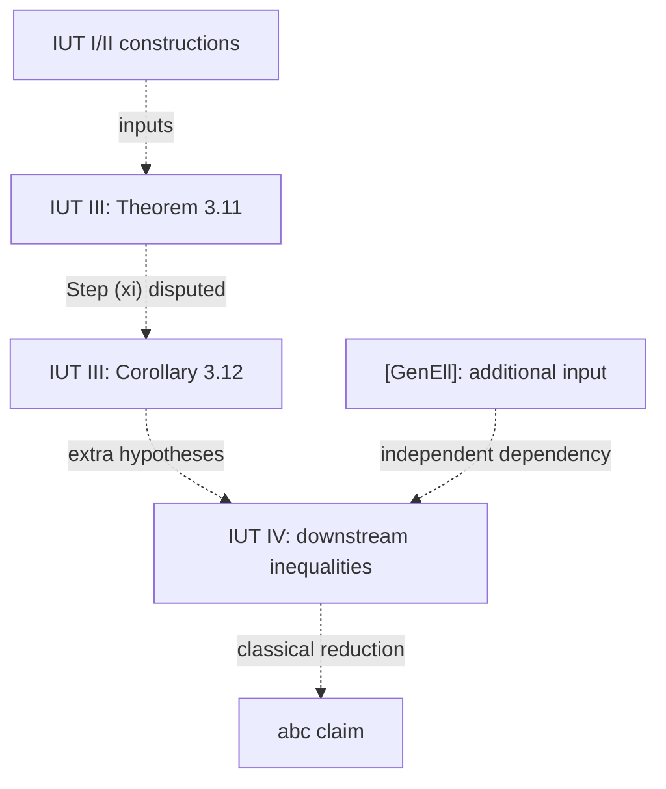

# Project map: what must be understood?

This is a first-pass *claim map*, not a chain of established implications.
The [original plan](../Research-project-plan.md) motivates four independent
questions:

1. What does the abc conjecture actually quantify over?
2. Which mathematical structures and estimates do IUT I–IV claim to supply?
3. How are those estimates claimed to yield an abc inequality?
4. Which comparison is disputed, and what would settle that precise question?

The first question is developed in [01](01-abc-target.md). The prerequisite
route is [02](02-prerequisites.md); questions 2–3 have a
[first-pass IUT route](03-iut-route.md) and
[claim graph](04-claim-dependencies.md), while question 4 has a
[source-paired dispute guide](05-critical-transition.md). The
[Lean audit](06-lean-boundary.md) supplies a *conditional* comparison.
The [critical-mechanism audit](09-critical-mechanism.md) and
[object-identity ledger](09b-object-identity-ledger.md) distinguish
SS's real-line comparison diagram from IUT III's hull inclusion.
The [adversarial trial](09a-adversarial-trial.md) tests the unresolved
native-$q$ comparison rather than adding unverified arrows.
Work still required is tracked in
[08](08-work-queue.md).

## Two directions of travel

```text
Read backwards for logical dependencies:
abc target <- downstream inequalities <- IUT III Corollary 3.12
                                   <- IUT III Theorem 3.11 and earlier IUT

Read forwards to learn constructions:
elementary abc -> arithmetic geometry -> IUT I/II constructions
               -> IUT III comparison -> IUT IV estimates -> abc claim
```

The arrows above are *questions to check*, not certifications. A diagram
linking theorem numbers does not tell us whether a theorem's hypotheses are
met, whether two copies of an object are being compared by a legitimate map,
or whether the claimed inequalities have the stated quantifiers.

The following *selected claim dependencies* are drawn from
[the claim ledger](04-claim-dependencies.md). Dashed arrows denote
dependencies to audit, **not proven implications**; the Theorem 3.11 to
Corollary 3.12 arrow contains the disputed Step (xi).



Keep three branches distinct:

| Branch | What to trace | What cannot be inferred |
| --- | --- | --- |
| [Primary papers](03-iut-route.md) and [claim graph](04-claim-dependencies.md) | Exact premises, constructions, theorem statements, and inference rules | Publication alone does not settle a criticism |
| [Criticism and response](05-critical-transition.md) | The strongest source-grounded versions of *both* interpretations | An objection alone is not a proof of the opposite claim |
| [Lean formalization](06-lean-boundary.md) | Exact declarations, assumptions, and verified downstream implications | A conditional theorem does not discharge its premise or validate the transcription |

## Evidence labels

Use labels **per proposition and per arrow**, never as an overall percentage
for the proof. More than one label may apply to the same node.

| Label | Meaning |
| --- | --- |
| `STANDARD` | A standard result or a calculation independently reproducible here; give a proof or source |
| `ASSERTED_IN_IUT` | A statement in the published papers; record its precise statement and locator |
| `DISPUTED` | A particular inference or interpretation challenged in the public exchange; cite both parties |
| `CONDITIONAL_FORMALIZATION` | Lean checks an implication assuming some named input; record the input's exact type |
| `UNVERIFIED` | A claim or diagram still inherited from the plan, without a checked primary locator |

Separately record whether a *source* was checked (`PDF_SECTION`, `CODE_SHA`,
`SECONDARY`, or `PLAN_ONLY`). `STANDARD` is not shorthand for "easy," and
`CONDITIONAL_FORMALIZATION` is not a verdict on the full published proof.
Different readers can have different *comprehension levels* (0: recognize;
1: explain the purpose; 2: apply; 3: reproduce a proof). These are not
mathematical-truth labels.

## Exit criteria for an arrow

For each `A -> B`, capture (a) the verbatim mathematical identifiers and
source page/section, (b) the exact hypotheses and quantified objects,
(c) which identity, reconstruction, comparison, or inequality takes us from
`A` to `B`, and (d) an independent attempt to check that operation. If any
item is missing, label the edge `UNVERIFIED`; if its justification is exactly
what is contested, label it `DISPUTED` and give both interpretations.

Read [the research queue](08-work-queue.md) for a reproducible sequence of
small checks. The deliverable is a map of *where* an explanation stops, not an
invented resolution beyond that stop.
