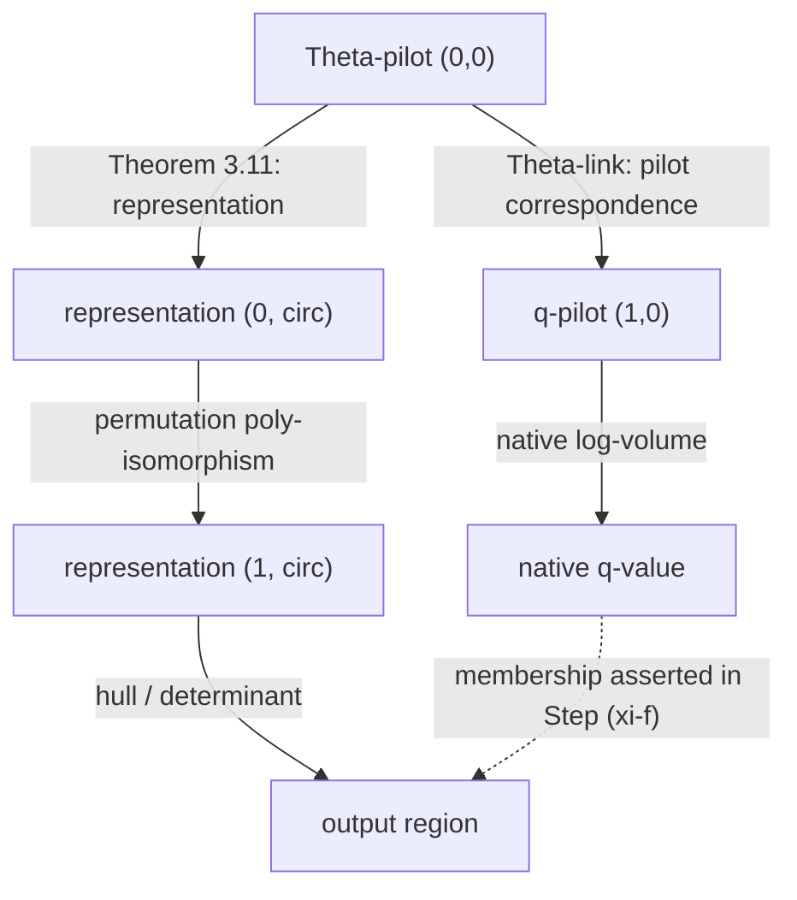

# 9. The critical mechanism: types before numerical comparisons

**Question.** What precisely licenses the move from the multiradial
representation in IUT III, Theorem 3.11, to the log-volume bound in
Corollary 3.12's Step (xi)? This is the `IUT-N1 -> IUT-N2` edge in the
[claim ledger](04-claim-dependencies.md). The
[source-paired dispute guide](05-critical-transition.md) reports both
interpretations; this file records smaller mathematical tests, **not a new
proof or a verdict on the published argument**. The later
[Project LANA interim report](sources.md) proposes a more specific
compatibility test; it explicitly does not prove it.

## An initial object and transport ledger

The entries below are an *audit index*, not an inventory of all the
objects in IUT. A citation to a definition or a participant's report
does not by itself verify a map's type or its numerical effect. Page
numbers refer to the hosted preprint PDFs listed in the
[source register](sources.md); earlier versions may differ.

| ID | Distinct object or passage | Source and reported relation | What remains to establish |
| --- | --- | --- | --- |
| `M1` | One fixed collection of initial $\Theta$-data (field, curve, prime, local choices) | [IUT I, Definition 3.1, PDF p. 61](sources.md); re-used for both columns in IUT III, Theorem 3.11, p. 153 | Sharing initial data does **not** make later theaters or their log-volume functions identical |
| `M2` | $\Theta$-Hodge theaters at labels $(0,0)$ and $(1,0)$, each with its own arithmetic holomorphic structure | [IUT I, Definition 3.6, PDF p. 87](sources.md); [IUT III, Theorem 3.11, p. 153](sources.md) | Preserve the labels; a common name is not an identity between theaters |
| `M3` | $\Theta$-pilot at $(0,0)$ $\leftrightarrow$ $q$-pilot at $(1,0)$ | [IUT I, Corollary 3.7(i), PDF p. 88](sources.md), and [IUT III, Definition 3.8(ii), pp. 112–113](sources.md): prime-strip **poly-isomorphism**; IUT I, Remark 3.7.1, p. 89, does not distinguish one cross-theater isomorphism | Not a ring/scheme isomorphism; no numerical log-volume identity follows solely from this correspondence |
| `M4` | Multiradial representations ${}^{0,\circ}\mathcal R_{\mathrm{LGP}}$ and ${}^{1,\circ}\mathcal R_{\mathrm{LGP}}$ | [IUT III, Theorem 3.11(i), pp. 153–155](sources.md): a *different*, permutation-symmetry poly-isomorphism transports representations across columns; Step (xi-b), pp. 181–182, invokes it | How this map combines with `M3`, and whether the **same** log-volume function survives horizontal transport, was not established by the passages independently checked |
| `M5` | Vertically varying log-Kummer correspondences | [IUT III, Theorem 3.11(ii), pp. 155–156](sources.md): one specified component is precisely compatible with log-volumes; (Ind3) records only upper semi-compatibility for others | Vertical compatibility is **not by itself** a theorem of horizontal `M4` log-volume preservation |
| `M6` | Abstract, concrete (including the $\ell^\star$-member $\Theta$ family), and arithmetic-degree real lines | [Scholze–Stix, section 2.2, PDF pp. 9–10](sources.md) draws six diagram nodes, with a literal equality at the bottom and a $j^2$ factor on the left; see [05](05-critical-transition.md) | Determine which diagram arrows are actual IUT isomorphisms of ordered real lines and which might instead encode non-invertible hull/containment |
| `M7` | A possible region $P$, its holomorphic hull $\phi(P)$, and the arithmetic line obtained by $\det^{\otimes M}(\phi(P))$ | [IUT III, Remark 3.9.5 (Ob1)–(Ob3), (Ob6), pp. 131–135](sources.md); used in Step (xi-d), p. 183: forming the hull may *increase* log-volume | Inclusion/majorization is not an equality of real-line isomorphisms; verify the actual bound and all of its (Ob8)/(Ob9) hypotheses in Step (xi) |
| `M8` | Native $-|\log(q)|$ and the Step-(xi) output region $\mathbb R_{\leq-|\log(\Theta)|}$ | [IUT III, Corollary 3.12, p. 173, Step (xi-d)–(xi-f), pp. 183–184](sources.md): membership of the native value in the region is **asserted**; the inference is `DISPUTED` | Exhibit the exact compatible route from `M3`/`M4`/`M7` to this *particular* native value, not merely an isomorphic copy |
| `M9` | Value-group real line $R_{\mathrm{val}}$ and volume-container real line $R_{\mathrm{ss}}$ | [Project LANA report, section 9.2, PDF p. 46](https://github.com/katobungen/LANA_report_202607/blob/b8e4636edea64d0b9fdc1d7f6a51e63c1f5d1676/LANA_report_202607.pdf#page=46) distinguishes their construction from BPS data; these are *the report's* model | Show that the two constructions below refer to compatible source **and** target copies, not merely isomorphic-looking real lines |
| `M10` | $\eta_q$ from the native $q$-pilot and $\eta^{\mathrm{anab}}_S$ reconstructed after a choice of integral-structure data $S$ | Same report, section 9.2, PDF p. 46: asks for a suitable $S$ with $\eta_q=\eta^{\mathrm{anab}}_S$ (9-1); p. 49 says the team does **not** have a proof | Establish existence of that $S$ and a compatible equality of maps; the report's proposed reduction is not itself a theorem of IUT III |

To complete an edge, write
`source (theater, object, numerical copy) -> operation -> target
(theater, object, numerical copy)`, with its exact domain, codomain,
hypotheses, preserved operations, permitted choices, and source passage.
**Unknown is an acceptable cell; silently writing `=` between different
copies is not.**

This is a **dependency sketch**, not a commutative diagram: the dashed
membership edge is what the argument must justify. In particular, the
top correspondence and the middle poly-isomorphism are different maps.

### Semantic dictionary for this edge

"Not licensed" means **not established by the cited, checked passage
alone**, not a claim that no other IUT lemma supplies the fact.

| Operation | Structure it gives or retains | What it does not identify by itself | Next legitimate comparison to check |
| --- | --- | --- | --- |
| $\Theta$-link (`M3`) | A poly-isomorphism of specified prime-strip/Frobenioid data and a pilot correspondence | The theaters' ring/scheme structures, a distinguished cross-theater isomorphism, or equal log-volumes | Type the pilot images in their respective theaters before assigning numbers |
| Permutation transport (`M4`) | A poly-isomorphism between the two labeled multiradial representations | The native $q$-pilot volume function with the transported $\Theta$-pilot volume function | Check its numerical effect under (Ind1)–(Ind3), separately from the $\Theta$-link |
| Vertical log-Kummer (`M5`) | Precise log-volume compatibility for a specified component, upper semi-compatibility for others | The horizontal compatibility of `M4` | Use the stated component and quantifiers; do not extrapolate to the entire lattice |
| Hull and determinant (`M7`) | An invariant container and an arithmetic line with a *one-sided* volume comparison | An invertible ordered-real-line map or equality of the original region's volume | Show that the **native** $q$-value lies in the correct output region (`M8`) |

## A concrete candidate for the missing comparison

Project LANA's [interim analysis, sections 8.3 and
9.2](https://github.com/katobungen/LANA_report_202607/blob/b8e4636edea64d0b9fdc1d7f6a51e63c1f5d1676/LANA_report_202607.pdf#page=43)
describes two proposed calculations of the *right-hand* $q$-pilot
log-volume. It constructs $R_{\mathrm{val}}$ from a BPS's value-group
portion and $R_{\mathrm{ss}}$ from its log-shell/volume-container data.
The native calculation gives a map $\eta_q$; the anabelian reconstruction
gives $\eta^{\mathrm{anab}}_S$ depending on an admissible choice $S$.
Its proposed main goal, equation (9-1) on PDF p. 46, is

$$
\exists S\ \text{admissible},\qquad
\eta_q=\eta^{\mathrm{anab}}_S
\quad\text{as suitably identified maps }R_{\mathrm{val}}\to R_{\mathrm{ss}}.
$$

In the report's interpretation, compatibility would make the original
$q$-pilot log-volume one of the admissible output-region values in the
right-hand volume container, yielding the numerical comparison. **The
report has not proved this compatibility** (section 10.5, PDF p. 49).
Its section 8.2, PDF p. 42, warns that merely knowing two weakened
objects are *isomorphic* is too weak to specify the necessary link.
This is a candidate *shared question* for our audit, not an assertion
that proving (9-1) alone checks every IUT dependency. Keep the pinned
[conditional Lean variant](06-lean-boundary.md) separate: it assumes a
numerical inequality and does not establish (9-1).

The report [sections 10.2–10.5, PDF pp. 47–49](https://github.com/katobungen/LANA_report_202607/blob/b8e4636edea64d0b9fdc1d7f6a51e63c1f5d1676/LANA_report_202607.pdf#page=47)
agrees that the real-line *hexagon* drawn by Scholze–Stix does not
commute, and says that making a proof factor through that diagram would
lose too much precision. It proposes that the intended argument instead
compares two constructions **within the right-hand holomorphic
structure**. Its team neither proves that the original argument
establishes (9-1) nor reaches complete consensus that it does not.
Agreement about the hexagon therefore does not settle the distinct
compatibility claim.

## A small algebraic reduction that can actually be checked

Let $T$ and $Q$ denote **real numerical values** corresponding to
$|\log(\Theta)|$ and $|\log(q)|$ *only if* the two passages being compared
use the same normalization and compatible real-number copies. If $Q>0$,
then the displayed form of IUT III's conclusion

$$
\forall C\in\mathbb R,\qquad -T\leq CQ\ \Longrightarrow\ C\geq-1
\tag{1}
$$

is equivalent, as an ordinary real-number statement, to $T\leq Q$.
For the forward direction, choose $C=-T/Q$ in (1); this forces
$-T/Q\geq-1$. Conversely, any $C$ in (1) satisfies
$C\geq-T/Q\geq-1$ when $T\leq Q$. The inequality quoted by
Scholze–Stix as the intermediate Step-(xi) conclusion,
$-Q\leq-T$, has the **same algebraic orientation** as $T\leq Q$.
For $Q=0$ and $T\geq0$, the premise in (1) holds for every $C$
and the conclusion is false. IUT III's proof itself explicitly invokes
$|\log(q)|>0$ at Corollary 3.12, PDF p. 173; we have not separately
derived that assertion from the initial data. For example,
$T=3,Q=2,C=-3/2$ is a counterexample to (1),
while $T=2,Q=3$ satisfies it.

This removes one *formal algebra* ambiguity from
[05, reproduction check 6](05-critical-transition.md). It **does not**
establish that the two papers' $T$ and $Q$ are the same normalized
quantities or that the Step-(xi) comparison producing $T\leq Q$
is legitimate. The primary text states $Q>0$; an independent check
of its underlying derivation remains a separate task. These are
source-level and mathematical obligations, not consequences of this lemma.

## Two copies: a non-proof countermodel to an untyped inference

Consider two distinct ordered one-dimensional real vector spaces
$V_A=\mathbb R e_A$ and $V_B=\mathbb R e_B$. The basis symbols are
coordinates for this example, **not distinguished parts of the
structures**. Let $x=e_A$, $y=e_B$, and measure coordinates in $V_B$
by $\mu_B(t e_B)=t$. Both
$f_1(e_A)=e_B$ and $f_2(e_A)=2e_B$ are positive linear isomorphisms.
Yet

$$
\mu_B(f_1(x))=1\leq\mu_B(y)=1,\qquad
\mu_B(f_2(x))=2\nleq\mu_B(y)=1.
$$

An inequality transported by **one** choice of isomorphism does not
therefore hold for **every** choice. If an additional structure
distinguishes the basis and requires its preservation, $f_2$ is no
longer admissible; if a theorem supplies a uniform estimate, that
estimate must be stated and checked. This model tests the distinction
between *a correspondence*, *an allowed transport*, and *a numerical
bound*. It models neither IUT's indeterminacies nor Mochizuki's
potentially nonlinear log-volume operation, and so refutes neither
party's actual argument.

### A source-grounded example of why a hull changes the question

Mochizuki's separate [2018 explanatory model, (LVEx), PDF pp.
24–26](sources.md) takes a region $R_{a,b}\subseteq\mathbb R^2$ and
adds its reflection to form $S_{a,b}$ for $a,b>0$. A direct area
calculation gives

$$
\mu_{\log}(R_{a,b})=\log(4a+2b)
\quad<\quad
\mu_{\log}(S_{a,b})=\log(4a+4b).
$$

The $4a$ is the central rectangle; the first region has two
one-sided strips of area $b$ each, and its symmetrization fills the
reflected strips as well. For $a=b=1$, this is simply
$\log 6<\log 8$. The example has a *separate* linear gluing map;
its strict volume inequality comes from taking a larger region,
not from multiplying a number by a scalar. The independent trial
recomputed these areas, but **neither** this example nor the
two-copy example above proves that IUT's actual Step-(xi) output
contains the *native* $q$-pilot value. That is precisely the
compatibility still to be checked.

## The next exact obligations

1. Type every real-number copy and comparison in Step (xi), including
   which normalizations and $j^2$ factors each uses. Match the hosted
   IUT III passage to the version cited in the 2018 objection.
2. Try to justify the report's $\exists S,\eta_q=\eta^{\mathrm{anab}}_S$
   using the paper's actual input/output maps and Ind1–3. If it cannot
   be typed or established, record the first failing comparison rather
   than writing a success-shaped substitute.
3. Note IUT III's explicit $Q>0$ in the Corollary 3.12 proof
   (p. 173); if auditing its derivation from the initial data,
   supply that premise separately. Decide whether the two cited
   inequalities concern the same normalized $T,Q$.
4. Spell out the allowed (Ind1)–(Ind3) choices and the precise
   quantifier over transports: a chosen map, all maps, or an invariant
   statement on a quotient. Check which preservation or bound Step (xi)
   supplies; do not import one from the toy model.
5. Give both sides this same typed statement. A genuine reconciliation
   needs a reviewed derivation under agreed hypotheses; a disagreement
   about types or admissible maps is an explicitly recorded stopping
   point, not a vote.

The independent-reading procedure and its results belong in
[09a](09a-adversarial-trial.md). The provisional ledger above should be
refined when exact domain/codomain passages have been checked.
